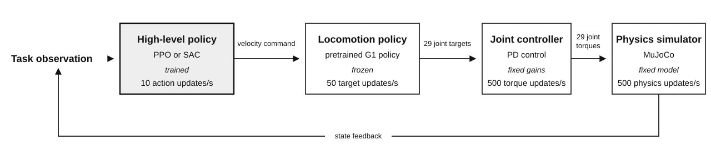
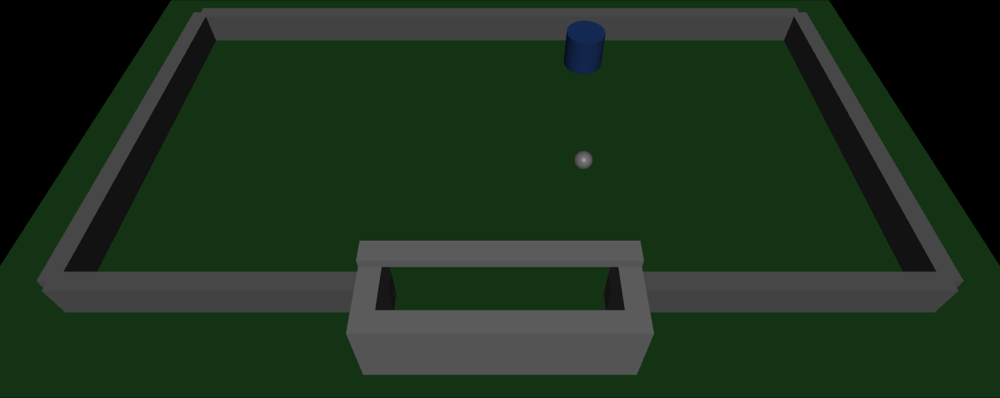
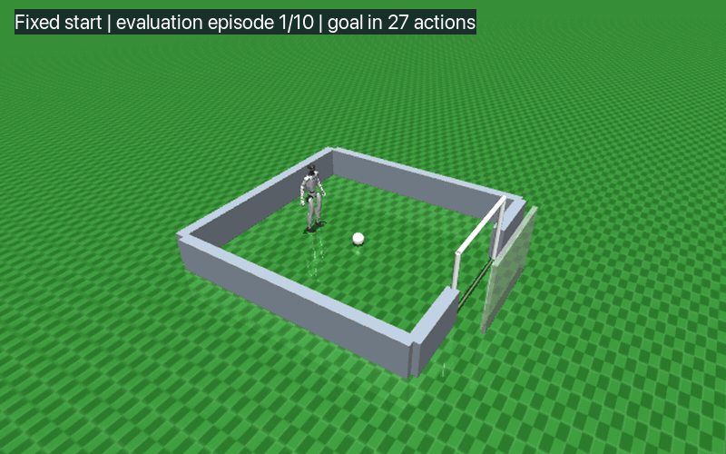
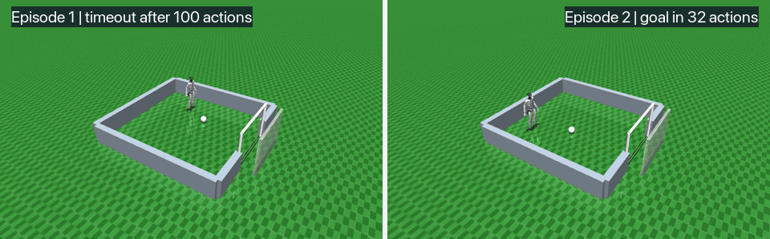
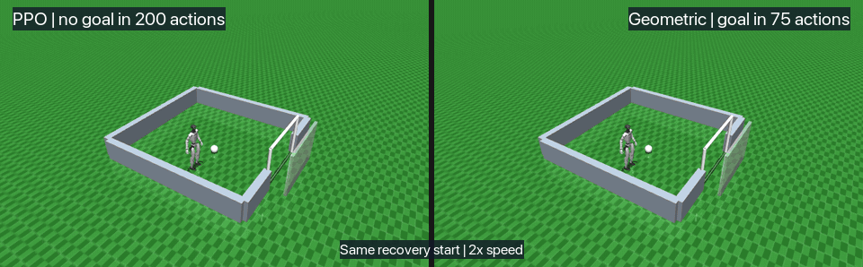

# soccer-rl

`soccer-rl` is an ongoing research project on reinforcement learning for
humanoid robot control. Its current objective is to train a simulated Unitree
G1 to position itself behind a ball and score a goal.

Development began with a 2D player and a 3D cylinder. These simpler agents
allowed reward and curriculum designs to be tested before adding humanoid
locomotion. This README documents the experiments conducted so far, including
approaches that did not improve performance.

https://github.com/user-attachments/assets/4939c91c-5118-42a9-a70c-d8ac4bae42fd

The video shows the current G1 controller scoring from one fixed initial state.

## System under study

The G1 uses hierarchical control. A high-level soccer policy chooses the
desired forward velocity, lateral velocity, and turning rate. A pretrained
low-level locomotion policy converts this command into coordinated targets for
the robot's joints. The main experiments train only the high-level policy.

The low-level policy comes from
[Unitree RL Lab](https://github.com/unitreerobotics/unitree_rl_lab). The robot
model comes from
[MuJoCo Menagerie](https://github.com/google-deepmind/mujoco_menagerie). Both
external components are fixed to specific revisions for reproducibility.

The experiments compare Proximal Policy Optimization (PPO) and Soft
Actor-Critic (SAC) for the high-level policy.



*Figure 1. Hierarchical G1 control architecture.*

The high-level policy currently receives task features computed from simulator
state rather than camera observations.

## Experiments and preliminary results

### 1. Curriculum learning on the 3D cylinder

Before training the G1, I replaced the humanoid with a cylinder controlled by
two horizontal velocity commands. This isolated curriculum and reward design
from humanoid locomotion.



*Figure 2. The blue cylinder replaces the humanoid while keeping the ball,
arena, and scoring objective.*

The environment uses a simple form of Automatic Curriculum Learning. One
difficulty value controls the range of initial positions, from a fixed easy
configuration to the complete target distribution. Success increases the
difficulty slightly, while failure reduces it. Progression therefore follows
the policy's performance instead of a predetermined training schedule.

Across three training seeds, contact-phased reward shaping increased final mean
success from 86.7% to 90.0%, while the standard deviation rose from 0.9 to 2.2
percentage points. The gain was small and more variable across seeds.

Reward shaping could bias the policy toward a hand-designed strategy that may
not suit new situations. Given its limited and less reliable gain, I preferred
to avoid it unless later experiments showed that it was necessary.

### 2. From fixed-start PPO to recovery failures

The first G1 policy trained from one fixed initial state. PPO scored in all 10
deterministic evaluation episodes, with no falls. This established that the
hierarchical control stack worked, but said little about the policy beyond that
single configuration.



*Figure 3. One of the ten deterministic fixed-start evaluations.*

I next randomized the robot and ball while always keeping the G1 behind the
ball relative to the goal. The fixed-start checkpoint scored in 36 of 100
episodes from this distribution. After another 200,704 interactions with an
adaptive curriculum, it reached 54 of 100.



*Figure 4. Two consecutive evaluations of the curriculum-trained PPO
checkpoint.*

Although randomized, these starts remained favorable: the G1 always began
behind the ball, already on the correct side to score. I therefore made the
task harder by introducing recovery starts. They placed the G1 beside the
ball, and sometimes slightly ahead of it, so the robot first had to recover a
position behind the ball before attacking the goal.

The best PPO version at this stage scored in 189 of 500 maximum-difficulty
episodes, or 37.8%. Some failures looked readily solvable: the robot backed
away from the ball but then hesitated instead of completing its reorientation
and approaching again.

### 3. Testing physical feasibility with a geometric controller

Those failures had three plausible causes. The high-level PPO policy might be
choosing poor commands. The frozen locomotion policy might be unable to execute
the required recovery movement. The movement itself might be physically
impractical for the simulated G1.

To identify the source of the failures, I kept the G1 and locomotion policy
unchanged, replacing PPO's learned command selection with hand-written
geometric rules.

Rather than designing and testing geometric rules manually, I used a coding
agent to automate this trial-and-error process. It piloted the G1 from simulator
state, diagnosed failed attempts, replayed ambiguous cases, and revised a
deliberately small rule set.

The resulting controller computes an approach point behind the ball, aligns
the G1 with the goal, and walks through the ball. If the ball blocks the direct
path, it adds one lateral detour. It recalculates its commands from the current
state at every step.



*Figure 5. Paired recovery evaluation.*

The first paired diagnostic selected ten starts on which PPO failed. The
geometric controller scored on all ten without falling, which showed that
those recovery movements were executable through the existing locomotion
stack.

The initial geometric rules scored only 32/100 on broader starts. After the
automated experiment loop improved alignment and added one detour rule, the
controller exceeded 90% on newly sampled episodes. This showed that a small set
of geometric rules could generalize across this class of recovery problems.

### 4. Learning alternatives

I first tested whether learning closer to the actuators could improve contact
with the ball. A PPO residual policy adjusted the 12 leg-joint targets produced
by the frozen locomotion policy. On 404 difficult contact cases, the baseline
scored 222 goals and fell 22 times. The residual scored 225 and never fell. It
improved stability, but not scoring or speed, so it did not solve the
high-level recovery problem.

I then compared PPO and SAC at the high level. Each learned policy used one
training seed and about 200,000 interactions. The evaluation used the same
1,000 behind-ball starts and a 200-step limit for every controller.

| Controller | Training reward | Goal success | Falls | Mean steps to goal |
| --- | --- | ---: | ---: | ---: |
| PPO | Approach-progress shaping | 844/1000 (84.4%) | 0.9% | 43.3 |
| SAC | Approach-progress shaping | 984/1000 (98.4%) | 0.2% | 36.5 |
| SAC | Sparse goal only | **986/1000 (98.6%)** | 0.1% | **34.9** |
| Geometric controller | No training | 962/1000 (96.2%) | **0.0%** | 58.0 |

SAC outperformed PPO in this run. Removing the approach-progress reward from
SAC changed success by only 0.2 percentage points, so SAC did not need the
hand-designed shaping strategy on this distribution. I retained the sparse SAC
policy for the next experiment. The current demonstration uses this checkpoint.

### 5. Broad generalization

High success on familiar starts did not show whether the learned policy could
handle different geometry. Earlier evaluations constrained the G1 to start
behind the ball, on the side opposite the goal. The broad test removes this
constraint, sampling the G1 and ball independently across the arena, with the
robot initially facing any direction. Sparse SAC fell from 98.6% on familiar
starts to 33.2% on 1,000 broad starts. More than half of these failures ended
with the robot stalled.

I continued training the same policy for 250,000 interactions with an adaptive
broad curriculum. The curriculum expanded the position and heading ranges as
the policy succeeded, instead of switching directly to the final distribution.

The final comparison uses the same 1,000 broad starts, a 500-step limit, and no
wall-safety layer.

| Controller | Training distribution | Goal success | Falls | Mean steps to goal | Stalled failures |
| --- | --- | ---: | ---: | ---: | ---: |
| Sparse SAC | Behind-ball starts | 332/1000 (33.2%) | 3.5% | 135.6 | 532 |
| Sparse SAC | Broad curriculum | 736/1000 (73.6%) | 1.2% | **122.3** | 211 |
| Geometric controller | No training | **910/1000 (91.0%)** | **0.1%** | 162.3 | **0** |

The broad curriculum recovered 40.4 percentage points and reduced stalled
failures from 532 to 211. The learned policy also reached the goal faster than
the geometric controller when it succeeded. It remains 17.4 points behind the
geometric reference, and it received more total training interactions than the
behind-ball checkpoint.

## Limitations

- G1 training has not yet been repeated across multiple training seeds.
- The high-level policy receives positions and velocities directly from the
  simulator instead of estimating them from camera images.
- The locomotion policy is pretrained and frozen, so this is not end-to-end
  humanoid learning.
- The task still uses one small arena, one goal, and no opponents.

Planned experiments will repeat the G1 comparisons across training seeds,
enlarge the arena and held-out pose distributions, and test whether a broader
curriculum can close the gap with the geometric controller without arbitrary
dense reward shaping.

## Reproducing the current G1 setup

The G1 stack requires Python 3.11, `uv`, and `make`. From the project root:

```sh
make setup-g1-locomotion
make download-g1-locomotion-policy
make check-g1-soccer-env
```

High-level checkpoints under `models/` are intentionally ignored. The current
sparse-reward SAC progression can be regenerated with:

```sh
make train-g1-soccer-sac-goal-only SEED=0 TIMESTEPS=200000
make train-g1-soccer-sac-broad-curriculum SEED=0 TIMESTEPS=250000
make evaluate-g1-soccer-sac-broad-curriculum EPISODES=1000
```
