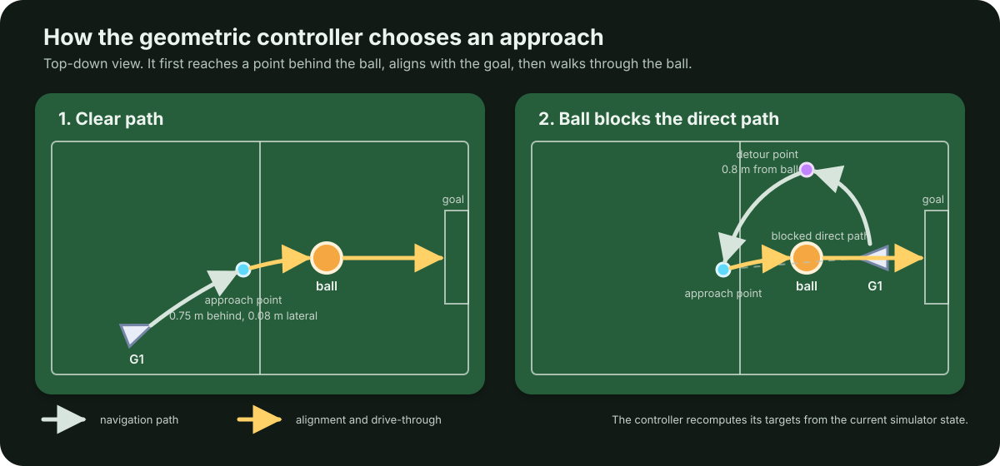
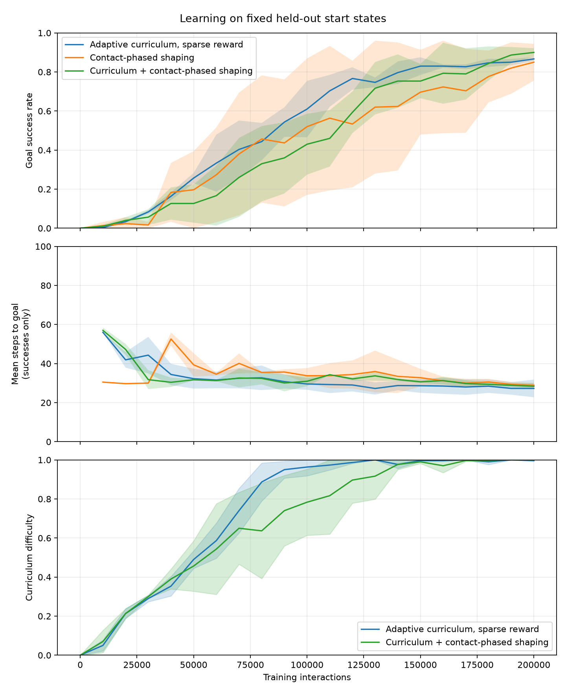

# soccer-rl

`soccer-rl` is an ongoing research project on reinforcement learning for
humanoid robot control. Its current objective is to train a simulated Unitree
G1 to position itself behind a ball and score a goal.

Development began with a 2D player and a 3D cylinder. These simpler agents
allowed reward and curriculum designs to be tested before adding humanoid
locomotion. This README documents the experiments conducted so far, including
approaches that did not improve performance.

> **Work in progress.** Current G1 results use one training seed, so comparisons
> between learning algorithms remain preliminary.

## Current demonstration

https://github.com/user-attachments/assets/3235febc-3b9e-4fca-87e5-4f55b680d67c

The video shows the current G1 controller scoring from one fixed initial state.

## System under study

The G1 uses hierarchical control. A high-level soccer policy chooses the
desired forward velocity, lateral velocity, and turning rate. A pretrained
low-level locomotion policy converts this command into coordinated targets for
the robot's joints. Only the high-level policy is trained in the current soccer
experiments.

The low-level policy comes from
[Unitree RL Lab](https://github.com/unitreerobotics/unitree_rl_lab). The robot
model comes from
[MuJoCo Menagerie](https://github.com/google-deepmind/mujoco_menagerie). Both
external components are fixed to specific revisions for reproducibility.

The experiments compare Proximal Policy Optimization (PPO) and Soft
Actor-Critic (SAC) for the high-level policy.

A proportional-derivative controller converts joint-target errors into
actuator torques. MuJoCo then simulates the resulting motion and contacts.

```text
high-level PPO or SAC policy (10 Hz)
    observation: robot-relative task and contact state
    action: desired forward velocity, lateral velocity, and turning rate
                         |
                         v
pretrained G1 locomotion policy (50 Hz)
    output: 29 joint-position targets
                         |
                         v
proportional-derivative controller -> 29 actuators -> MuJoCo physics (500 Hz)
```

This hierarchy isolates the question *where should the robot move?* from the
lower-level problem *how should its joints produce that motion?* The high-level
policy currently receives simulator state rather than camera observations.

### The geometric reference

The learned policies are compared with a deterministic controller that reads
the same task geometry. It computes an approach point behind the ball. If the
ball blocks the direct route to that point, it first walks to a lateral detour.
Once positioned, it aligns with the goal and walks through the ball.



This controller does not learn. It is a useful reference because it separates
two causes of failure. If the geometric controller succeeds and a policy
fails, the locomotion stack can execute the maneuver and the remaining problem
is high-level control. Its performance does not constitute evidence of learned
generalization because the route was designed by hand.

## Research progression

| Observation | Hypothesis tested | Result | Decision |
| --- | --- | --- | --- |
| Goal rewards were rare in the randomized cylinder task. | Intermediate rewards or progressively harder starting positions might make the task learnable. | Both methods learned. Intermediate rewards alone varied much more across seeds, while combining both methods had the highest final mean. | Use progressive randomization to expand difficulty, then test rewards separately. |
| A fixed G1 start worked, but recovery starts exposed hesitation and poor reorientation. | Additional intermediate rewards or longer episodes might teach recovery. | Several reward variants changed behavior without reliably solving the hard cases. | Build a deterministic geometric controller to test whether the locomotion stack could execute the missing maneuvers. |
| The geometric controller solved many starts that the learned policy missed. | The main limit was high-level control rather than the pretrained locomotion policy. | The robot could approach, reorient, and score from the same simulator states. | Use geometric control as a diagnostic reference and broaden the learned policy's training distribution. |
| Some goals depended on which foot was moving forward, and the baseline occasionally fell during contact. | A learned correction to the leg targets might improve the kick. | Falls dropped from 22 to 0 on 404 paired cases, but goals changed only from 222 to 225. | Record the stability gain; the result does not support a claim of improved kicking performance. |
| SAC performed well when the robot started behind the ball but failed when its position and orientation varied more widely. | The policy had learned the original range of starting positions rather than general movement around the ball. | Training on progressively broader starts improved the held-out benchmark, but still trailed the hand-written controller. | Continue expanding difficulty and test on larger arenas and unseen starting poses. |

## Experiments and preliminary results

### 1. Curriculum learning and reward shaping on the 3D cylinder

The first controlled experiment asked whether PPO could learn the randomized
task from a sparse goal reward when paired with an adaptive curriculum, and
whether contact-phased shaping improved learning.

The sparse reward provides feedback only after a goal. The adaptive curriculum
expands the range of starting positions as the policy improves.
Contact-phased shaping gives intermediate rewards for approaching the ball
before contact, then for moving the ball toward the goal.

**Protocol.** PPO, 200,000 training interactions, three training seeds, and 100
held-out evaluation episodes every 10,000 interactions. Every strategy is
evaluated on the same final start-state distribution.

| Training strategy | Mean goal success at 200k | Standard deviation |
| --- | ---: | ---: |
| Adaptive curriculum, sparse goal reward | 86.7% | 0.9 percentage points |
| Contact-phased shaping, no curriculum | 85.0% | 9.4 percentage points |
| Adaptive curriculum + contact-phased shaping | **90.0%** | 2.2 percentage points |



Lines show the mean across three training seeds. Shaded bands show one
standard deviation.

**Interpretation.** A curriculum was sufficient to learn from the sparse goal
signal, so dense shaping was not strictly necessary. Contact-phased shaping
could learn quickly, but was much more sensitive to the training seed. The
combined strategy achieved the highest final mean in this small experiment,
although three seeds are not enough for a definitive ranking.

### 2. PPO, SAC, and sparse-reward ablation on G1

The first G1 benchmark uses randomized starts that always place the robot
behind the ball. This is the distribution used to train the three policies.
The sparse variant receives a task reward only after scoring. Approach-progress
shaping also rewards movement toward the ball and the goal.

**Protocol.** One training seed per policy, about 200,000 training interactions,
and 1,000 shared evaluation starts. Episodes last at most 200 high-level steps.
The wall-safety layer used in the demonstration is disabled during evaluation.

| Controller | Training reward | Goal success | Falls | Mean steps to goal |
| --- | --- | ---: | ---: | ---: |
| PPO | Approach-progress shaping | 844/1000 (84.4%) | 0.9% | 43.3 |
| SAC | Approach-progress shaping | 984/1000 (98.4%) | 0.2% | 36.5 |
| SAC | Sparse goal only | **986/1000 (98.6%)** | 0.1% | **34.9** |
| Geometric controller | No training | 962/1000 (96.2%) | **0.0%** | 58.0 |

The demonstration uses the sparse SAC checkpoint, with the wall-safety layer
enabled only for filming.

**Interpretation.** In this run, SAC did not need the approach-progress reward
on this distribution. Removing it changed success by only 0.2 percentage
points and slightly reduced the successful episode length. PPO scored less
often in this run, but one training seed is not enough to conclude that SAC is
generally the better algorithm. The geometric controller was reliable but
slower because it uses separate approach, alignment, and drive-through phases.

### 3. Generalization to broad G1 initial poses

The broad distribution moves both the robot and ball across the arena and
samples the robot's initial heading over the full circle. This includes recovery
and reorientation problems that are absent from the original behind-ball
training distribution.

**Protocol.** The same 1,000 broad starts for every controller, with a 500-step
episode limit and no wall-safety layer. The simple SAC policy trained for
200,000 interactions on behind-ball starts. The broad-curriculum policy then
continued training for 250,000 interactions while the start distribution
expanded. The geometric controller received no training.

| Controller | Training distribution | Goal success | Falls | Mean steps to goal | Stalled failures |
| --- | --- | ---: | ---: | ---: | ---: |
| Sparse SAC | Behind-ball starts | 332/1000 (33.2%) | 3.5% | 135.6 | 532 |
| Sparse SAC | Broad curriculum | 736/1000 (73.6%) | 1.2% | **122.3** | 211 |
| Geometric controller | No training | **910/1000 (91.0%)** | **0.1%** | 162.3 | **0** |

A stalled failure is an unsuccessful episode in which the robot moves less
than 0.2 m and averages below 0.08 m/s over the final 30 high-level steps.

**Interpretation.** The 65.4-point drop between the familiar and broad
benchmarks exposed a generalization problem that the first benchmark hid.
Broad curriculum training recovered 40.4 points, so much of the failure came
from the training distribution rather than an absolute locomotion limit. It
still left a 17.4-point gap to the hand-written reference. This comparison does
not isolate curriculum design from training time because the curriculum policy
received 250,000 additional training interactions.

### 4. Low-level kick residual

The final experiment trained a PPO residual policy to adjust the 12 leg-joint
targets produced by the pretrained locomotion policy. It was tested against
unchanged locomotion commands on 404 difficult cases. These cases varied the
phase of the walking cycle, the contact distance, and the lateral offset.

| Controller | Goals | Falls | Mean steps to goal |
| --- | ---: | ---: | ---: |
| Pretrained locomotion, zero residual | 222/404 (55.0%) | 22 | 157.6 |
| Learned low-level residual | 225/404 (55.7%) | **0** | 157.8 |

**Interpretation.** The residual eliminated falls on this challenge set, but
did not materially improve scoring or speed. In paired outcomes it fixed 40
baseline failures while causing 37 baseline successes to fail. This is
evidence of a stability benefit, not yet of a better kick controller.

## Current findings

- Adaptive task difficulty made the sparse goal reward learnable without
  encoding the route in a shaping function.
- The geometric controller separates locomotion limits from failures in the
  learned high-level policy.
- Broader initial-state distributions expose recovery and reorientation as the
  current high-level bottlenecks.
- Adding a learned residual at a lower control level does not automatically
  improve the task objective; isolated, paired evaluations are necessary.

## Limitations

- G1 training has not yet been repeated across multiple training seeds.
- The high-level policy receives positions and velocities directly from the
  simulator instead of estimating them from camera images.
- The locomotion policy is pretrained and frozen, so this is not end-to-end
  humanoid learning.
- The arena and initial-state distributions are still limited relative to a
  general football task.
- All results are simulation-only.

Planned experiments will repeat the G1 comparisons across training seeds,
enlarge the arena and held-out pose distributions, and test whether a broader
curriculum can close the gap with the geometric controller without arbitrary
dense reward shaping.

## Reproducing the current G1 setup

The G1 stack uses Python 3.11 and the `uv` package manager for its isolated
environment:

```sh
make setup-g1-locomotion
make download-g1-locomotion-policy
make check-g1-soccer-env
```

The downloaded locomotion model is pinned by revision and SHA-256 checksum.
High-level checkpoints under `models/` are intentionally ignored; they can be
regenerated with the training targets in the `Makefile`.

For example, the current sparse-reward SAC progression is:

```sh
make train-g1-soccer-sac-goal-only SEED=0 TIMESTEPS=200000
make train-g1-soccer-sac-broad-curriculum SEED=0 TIMESTEPS=250000
make evaluate-g1-soccer-sac-broad-curriculum EPISODES=1000
```
